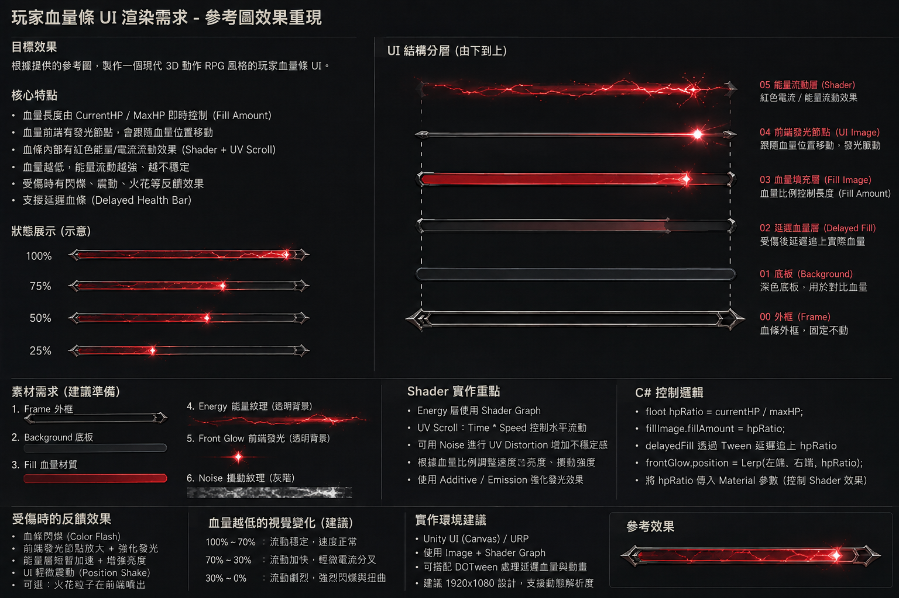

# 血量條 UI 系統 - 設計文件

給下一個大型 Boss 接血量條時直接查這份文件即可，不需要重新摸索。

## 參考圖

`ReferenceMockup.png`（跟本文件放在同一個資料夾）是這整套系統的原始設計依據，專案裡另外還存了一份完整拷貝在
`Assets/_Project/UI/Textures/HealthBarArt/Source/HealthBarReferenceMockup.png`（Bake 流程實際讀取的是這一份，路徑寫死在
`PlayerHealthBarFxSetup.BakeArt`）。



## 目前已接的實例

| 使用者 | 類型 | 場景路徑 | 建置工具 |
|---|---|---|---|
| 玩家 (Player) | 螢幕空間 (Screen Space Overlay) | `PlayerCornerHud/Panel/生命Track` | `Tools/Live2DAction/Add Player Health Bar FX` |
| 076（火焰人 Live2D 看板） | 世界空間，浮頭頂、面向攝影機 | `076_DoNotShip/HealthBarCanvas` | `Tools/Live2DAction/Add 076 Health Bar (Reference Art)` |
| 屁孩王 (Boss) | 世界空間，血量 + 架勢 + 能量三條 | `屁孩王/HealthBarCanvas`、`.../StanceBarCanvas`、`.../EnergyBarCanvas` | `Tools/Live2DAction/Add PiHaiWang Health Bar (Reference Art)`（血量）+ 架勢/能量條為手接/複製 |
| 武士 (Boss) | **螢幕空間（隻狼式）**，頂部置中三條（架勢/血量/LeapSlam 能量） | `WushiBossHud/武士_架勢`、`.../武士_生命`、`.../武士_能量` | `Tools/Live2DAction/Add Wushi Bars (Sekiro-style Boss HUD + LeapSlam Energy)` |

全部共用同一組 6 張烘焙美術 + Shader/Material + `PlayerHealthBarFx`/`StancePoiseBarFx`/`UltimateEnergyBarFx` 元件——
差別只在 Canvas 的 `renderMode`、尺寸單位、`billboardToCamera`。

**武士走「螢幕 HUD」路線**（`WushiBarsSetup.cs`，2026-08-28 追加15 改）：武士體型太大（4x），頭頂世界空間條在正常鏡頭下常
超出畫面，改成固定螢幕 HUD（像《隻狼》的 boss 血量條）。做法：`Object.Instantiate` **`PlayerCornerHud` 的三個螢幕空間
track**（`架勢Track`/`生命Track`/`必殺Track`——已經是 pixel 單位、`billboardToCamera=false`）到新的 `WushiBossHud`
（ScreenSpaceOverlay、CanvasScaler 1920×1080），頂部置中堆疊、子美術層寬度撐到 boss 寬，再把 Fx 的
`health`/`stance`/`energy` 重新指向武士（Instantiate 已自動 remap 內部參照）。武士的能量條配的是 LeapSlam 能量
（`UltimateEnergy` max 100 / 5-per-1s = 20 秒滿）。下一個大型 boss 要螢幕 HUD 直接複製 `WushiBarsSetup.cs` 改 `BossName`
+ `Bars[]` 常數即可。

畫面正中央另外還有一個**放大版視覺測試**（`HealthBarPreview_TEMP`），目前已停用但保留在場景裡，作為「這套系統長什麼樣子」的
快速參考——需要再看一次的話，直接在 Hierarchy 把它打開，或重新執行
`Tools/Live2DAction/Add Health Bar Preview (Temp)`（它會複製玩家角落 HUD 目前的血量列並放大置中）。

---

## 一、分層架構（由下到上）

跟參考圖「UI 結構分層」欄位完全對應，GameObject 名稱就是這樣命名：

| 層 | GameObject | 型態 | 說明 |
|---|---|---|---|
| 00 外框 Frame | `Frame` | `Image`，非 Filled | 固定不動的外框，中空造型 + 兩端菱形尖角 |
| 01 底板 Background | `Background` | `Image`，非 Filled | 深色底板，血條抽乾時露出來對比用 |
| 02 延遲血量 DelayedFill | `DelayedFill` | `Image.Type.Filled`（Horizontal, Origin=Left） | 受傷後延遲追上實際 HP 的殘影血條 |
| 03 血量填充 Fill | `Fill` | `Image.Type.Filled`（Horizontal, Origin=Left） | 目前 HP 比例，`PlayerHealthBarFx.currentFillImage` |
| 05 能量流動 EnergyFlow | `EnergyFlow` | `Image.Type.Filled` + `HealthEnergyFlowUI` 材質 | 疊在 Fill 上面、會 UV Scroll 的紅色電流 |
| 04 前端發光 EdgeGlow | `EdgeGlow` | `Image`（非 Filled，位置每幀更新） | 跟著目前 fillAmount 邊緣移動的發光節點，受傷時會放大 |
| 火花 Spark0-5 | `Spark0`..`Spark5` | `Image`，預設隱藏 | 受傷瞬間從 EdgeGlow 位置噴出的小火花粒子（純 UI Image，不用 ParticleSystem） |

Value（HP 數字文字）只有玩家版才有；076 這種浮空血條沒有文字（跟舊版 `WorldSpaceHealthBar` 的慣例一致）。

`DelayedFill`／`Fill`／`EnergyFlow` 三層都用 `Image.Type.Filled`，所以在 fillAmount < 1 時，右側（或視角度而定的
另一側，見「已知眉角」）尾端本來就會被裁掉、露出底下的 Background/Frame——這就是「延遲血條」跟「固定外框」視覺上如何互相
穿透的原理，不需要額外遮罩。

---

## 二、美術素材從哪裡摳出來的

**不要**再從參考圖右側「UI 結構分層」那個示意圖欄位摳 Fill / EnergyFlow / 前端發光——那三張其實是「血量約 80%
時的合成示意圖」，本身已經烘了一個發光爆閃 + 一段黑色燒焦暈染，疊上我們自己另外算的動態發光節點會變成兩個爆閃疊在一起、
外加一塊髒污色塊（曾經真的踩到這個坑，見 `PlayerHealthBarFxSetup.cs` 開頭的註解）。

正確作法：

- **Frame / Background / DelayedFill** 三層 → 從右側「UI 結構分層」欄位摳（這三張本來就沒問題）。
- **Fill / EnergyFlow / 前端發光(Spark)** 三層 → 改從左下角「**素材需求 (建議準備)**」那個區塊摳，那邊本來就準備了
  獨立、乾淨的素材：
  - `3. Fill 血量材質` — 純色紅色實心長條，沒有爆閃、沒有暈染
  - `4. Energy 能量紋理（透明背景）` — 單獨一條閃電紋理，適合拿去做 UV Scroll
  - `5. Front Glow 前端發光（透明背景）` — 單獨一顆星芒爆閃，拿來當 EdgeGlow / 火花的素材

所有裁切座標都寫死在 `PlayerHealthBarFxSetup.cs` 最上面（`FrameSourceRect`／`BackgroundSourceRect`／...），是直接
對著 `HealthBarReferenceMockup.png`（1536x1024）用一般看圖軟體的左上角原點座標量出來的；`BakeLayer()` 內部會自己轉成
`Texture2D.GetPixels` 需要的左下角原點座標，不用自己換算。

### Alpha 烘焙門檻

`BakeLayer()` 用亮度（luminance）做去背，兩組門檔各自對應不同素材類型：

- **輪廓層**（Frame/Background/DelayedFill/Fill，本身有實體形狀）：`SilhouetteLumLow=0.075, SilhouetteLumHigh=0.11`
  ——區間很窄，因為量測結果顯示純黑背景亮度約 0.055-0.07，而條本身最暗的地方也有 0.09-0.145，中間留一點安全間隔。
- **發光層**（EnergyFlow/Spark，本身是透明背景上的一撮光）：`GlowLumLow=0.13, GlowLumHigh=0.45`——區間拉寬讓暗光暈
  自然淡出，且刻意把下限抬高到明顯高於背景雜訊天花板（第一版直接卡在雜訊邊緣，在小尺寸 HUD 上看不出來，放大 4.5 倍做視覺
  測試時才發現變成一坨髒污）。

想再加新的素材（例如以後想幫某層換一張新圖）時，先用 PowerShell/`System.Drawing` 或任何看圖工具在**原始 mockup 圖片**上
量出目標區域四角的亮度值，確認背景跟內容的亮度有明顯間隔，再照這個模式寫閾值——不要直接沿用某層的門檻套到新素材上，
每張圖的雜訊天花板都可能不一樣。

### 烘焙輸出

全部寫到 `Assets/_Project/UI/Textures/HealthBarArt/`：`00_Frame.png`、`01_Background.png`、`02_DelayedFill.png`、
`03_Fill.png`、`05_EnergyFlow.png`、`Spark.png`。每次執行 `Add Player Health Bar FX` 都會重新烘焙覆蓋這些檔案
（`BakeArt()` 是 idempotent 的，不用擔心重複執行）。

---

## 三、Shader — `Live2DAction/UI/HealthEnergyFlow`

檔案：`Assets/_Project/VFX/Shaders/HealthEnergyFlowUI.shader`　材質：`Assets/_Project/VFX/Materials/HealthEnergyFlowUI.mat`

只掛在 `EnergyFlow` 這一層上（`Fill` 本身是純色，不帶 Shader）。核心機制就是 UV Scroll 教學那三步：
**UV → Time × Speed → Offset → Texture Sampling**，`_MainTex` 直接是上面摳出來的「4. Energy 能量紋理」，不是程式產生的雜訊。

Properties：

| 名稱 | 用途 | 誰在寫 |
|---|---|---|
| `_FlowSpeed` | 100%-70% HP 區間的基礎流動速度 | Inspector 手動調（設計參數，不是 runtime） |
| `_NoiseScale` | 低血量扭曲用的雜訊頻率 | Inspector 手動調 |
| `_HpRatio` | 目前 fillAmount（0-1） | `PlayerHealthBarFx` 每幀寫入 |
| `_GlowIntensity` | 低血量常駐發光 **與** 受傷瞬間發光尖峰的合併值（`Mathf.Max`） | `PlayerHealthBarFx` 每幀寫入 |
| `_FlashIntensity` | 受傷瞬間把整層閃白，會自然衰減回 0 | `PlayerHealthBarFx` 每幀寫入 |
| `_SpeedBoost` | 受傷瞬間額外加速流動，會自然衰減回 0 | `PlayerHealthBarFx` 每幀寫入 |

`_HpRatio` 驅動的「越不穩定」效果是連續函式（`unstable = saturate((0.7-hpRatio)/0.7)` 再平方），不是寫死的
if/else 三段式，所以 70%／30% 那兩個分界不會有畫面跳動：

- **100%~70%**：`unstable≈0`，流動速度=`_FlowSpeed`，無扭曲、無閃爍。
- **70%~30%**：`unstable` 緩升，流動變快、開始有輕微 UV 扭曲。
- **30%~0%**：`unstable→1`，流動最快、扭曲最明顯、外加一個 45Hz 的快速閃爍係數（`flicker`）。

材質是**每個實例各自 New 出來的**（`PlayerHealthBarFx.Awake()` 會 `new Material(energyFlowImage.material)` 再指回去），
不會共用同一顆共享資產、也不會把 runtime 數值污染回 `.mat` 檔本身——這個習慣在專案裡到處都是（參考
`LightPillarURP`/`UpdraftActivationEffect` 那個模式），加新 Boss 時不用額外處理。

---

## 四、C# — `PlayerHealthBarFx`

檔案：`Assets/_Project/Game/UI/PlayerHealthBarFx.cs`　純數學：`Assets/_Project/Game/UI/HealthBarTweenUtility.cs`
（已有 EditMode 測試 `HealthBarTweenUtilityTests.cs`，16 條全過）。

**名字雖然叫 Player，但完全沒有任何寫死 Player 的邏輯**——只認得它被接上的 `Health`/`Image`/`RectTransform`，
所以 076 直接原樣沿用，未來任何 Boss 也可以直接沿用，不需要另外寫一個新元件。

### 只需要接的欄位（SerializedObject 方式，不是 Inspector 拖拉）

`health`、`currentFillImage`（Fill）、`delayedFillImage`（DelayedFill）、`energyFlowImage`（EnergyFlow）、
`edgeGlowRect`（EdgeGlow 的 RectTransform）、`trackRect`（整條血條的根 RectTransform，震動效果會動這個）、
`valueText`（有數字才接，Boss 通常不用）、`sparkRects`（6 個 Spark 的 RectTransform 陣列）、
`billboardToCamera`（世界空間才打開）。

### 行為總覽

- **Tween**：`_displayedFill` 用 `HealthBarTweenUtility.SmoothApproach`（指數逼近，frame-rate 無關）平滑追向真實 HP。
- **延遲血條**：`_delayedFill` 用 `ComputeDelayedFill`——扣血時「先原地停留 `delayHoldSeconds` 秒，再用
  `delayCatchUpSpeed` 追下去」；補血時直接瞬間跳上去（不延遲）。
- **前端發光**：`ComputeEdgeGlowLocalX` 算出目前 fillAmount 對應的邊緣 X 座標（考慮 `edgeInset`），每幀更新
  `edgeGlowRect.anchoredPosition`；受傷瞬間額外做一個 `edgeGlowScaleBoostMax` 的縮放脈衝再衰減回 1。
- **受傷回饋**（訂閱 `Health.Damaged` 事件，不是每幀比較血量差——跟 `StancePoise` 訂閱同一個事件是同一套慣例）：
  同時觸發 `_flashIntensity`／`_hitGlowIntensity`／`_shakeIntensity`／`_speedBoostIntensity`／`_edgeGlowScaleBoost`
  五個數值瞬間拉滿，各自有自己的衰減速度，全部丟給 Shader 或直接動 RectTransform。
- **震動**：`HealthBarTweenUtility.ComputeShakeOffset`（兩條互不相關的 Perlin noise walk，不是 `Random.value`
  白噪音，衰減時才不會像在抖動而是自然收斂），動的是 `trackRect.anchoredPosition`。
- **火花**：受傷瞬間對 6 個 Spark 各自算一個隨機角度，用 `ComputeSparkOffset`（簡單彈道拋物線）從 EdgeGlow 目前位置
  噴出去、邊飛邊淡出，`sparkLifetime` 秒後全部關閉。純 UI Image 位置動畫，沒有用 ParticleSystem
  （Screen Space Overlay Canvas 裡混 ParticleSystem 的疊層順序很難搞定，這是刻意的技術選型）。

### 像素/公尺單位換算（重要——加新 Boss 時一定要做這件事）

`shakeMagnitude`、`sparkSpeed`、`sparkGravity`、`edgeInset` 這幾個數字，預設值（`6f`／`90f`／`220f`／`2f`）是照
玩家 HUD 那個 176px 寬的血條列調校出來的。世界空間的血條如果直接照抄這幾個預設值，震動幅度會變成六公尺、火花用秒速
90 公尺噴出去——完全不成比例。

正確做法（`Enemy076HealthBarSetup.cs` 已經示範過）：算一個 `unitScale = 這次血條的實際寬度 / 176f`，再把上面那幾個
欄位乘上這個係數後才寫進 `SerializedObject`。`fillTweenSpeed`／`delayHoldSeconds`／`delayCatchUpSpeed`／
`lowHealthThreshold`／`flashDecaySpeed`／`glowDecaySpeed`／`shakeDecaySpeed`／`speedBoostDecaySpeed`／
`edgeGlowScaleBoostMax`／`edgeGlowScaleDecaySpeed`／`sparkLifetime` 這些是時間或 0-1 比例，跟單位無關，維持預設值即可。

---

## 五、給下一個 Boss 的操作步驟

1. 確認 `Assets/_Project/UI/Textures/HealthBarArt/` 底下 6 張圖跟
   `Assets/_Project/VFX/Materials/HealthEnergyFlowUI.mat` 都已存在——如果專案是全新的，先跑一次
   `Tools/Live2DAction/Add Player Health Bar FX`（它會重新烘焙）。
2. 複製 `Assets/Editor/Bootstrap/Enemy076HealthBarSetup.cs`，改名成新 Boss 專用的檔案。
3. 改寫 `Find076()`：076 是靠「同時掛 `EnemyAI`+`Health`+`PlayerCombat`」這個元件組合去找的，因為它的 GameObject
   名稱會被 Cubism 重新匯入自動清空（見下方「已知眉角」）。新 Boss 如果沒有這個命名不穩定的問題，直接
   `GameObject.Find("BossName")` 或用 tag 找即可，不必照抄這個 workaround。
4. `BarWidthFraction`（目前 076 用 0.6）跟 `MarginAboveHeadWorld`（目前 0.25 公尺）依 Boss 體型視覺調整——用
   `GetComponentsInChildren<Renderer>` 量出真實世界座標邊界（`bounds.size.x`＝寬、`bounds.max.y - root.position.y`
   ＝頭頂相對根節點的世界偏移），不要憑感覺猜一個數字。
5. `canvasGo.transform.localScale = Vector3.one / rootScale`——如果 Boss 的根節點本身有非 1 的縮放（076 是 5 倍），
   一定要用這個抵消，不然 Canvas 的 RectTransform 單位就不等於實際公尺數，位置跟大小都會算錯（舊版
   `WorldSpaceHealthBar` 就是漏了這一步，血條才會浮在明顯偏高的地方）。
6. 记得把 `billboardToCamera` 打開（世界空間才需要）。
7. 執行前務必確認不在 Play Mode（`EditorSceneManager.OpenScene` 在 Play Mode 中會直接丟例外，這是這個專案的
   Bootstrap 腳本共同的地雷，`Enemy076HealthBarSetup.Apply()` 開頭已經擋了一次，新檔案照抄那段檢查就好）。

---

## 六、已知眉角

- **填充方向跟角色朝向有關**：`Image.FillMethod.Horizontal` + `Origin=Left` 是相對 Canvas 自己的本地座標系，
  Billboard 轉向攝影機後，畫面上「看起來的左邊」到底對應 0% 還是 100%，取決於這個角色的 Root Transform 預設朝哪個
  方向。076 身上實測結果是畫面右側＝滿血端——這不是 bug，純粹是這個角色模型自己的朝向決定的，不需要為了「統一畫面
  方向」去翻轉程式邏輯，正常遊戲鏡頭角度下不會有人注意到這件事。
- **Unity Editor 有時候會卡住不跑 Update()**：這個環境偶爾會遇到 Play Mode 進去後 `Time.frameCount` 卡住不動、
  MonoBehaviour 的 `Update()`/`Coroutine` 完全不推進的狀況（跟有沒有把 Game View 對到焦點有關，是環境本身的怪癖，
  不是這套血量條系統的 bug）。測試時如果畫面死掉沒反應，可以直接用 reflection 手動連續呼叫
  `PlayerHealthBarFx.Update()` 幾百次（每次呼叫用的是當下真實的 `Time.deltaTime`）繞過去驗證邏輯，這份文件所有截圖
  驗證過程都用過這招。
- **076 的 GameObject 名稱會自動被清空**：這是 Live2D/Cubism 重新匯入時的已知現象（不是這次改動造成的），
  `Enemy076HealthBarSetup.Apply()` 每次執行都會把它改回 `076_DoNotShip`，但下次重新匯入模型後可能又被清空——
  這是為什麼 `Find076()` 用元件組合而不是名稱去定位它。
- **每次改完場景記得做一次「殘留空引用」掃描**：整個專案的慣例是用 `SerializedObject` 掃描所有
  `MonoBehaviour` 的 `ObjectReference` 欄位，找 `objectReferenceValue == null && objectReferenceInstanceIDValue != 0`
  （代表指向一個已被刪除的物件，不是本來就沒接的欄位）。這套血量條系統本身在開發過程中就是靠這個掃描抓到過
  `TimeTrialStartMechanism`/`UpdraftActivationEffect` 這類斷參照問題的同一招，加新 Boss 時建議也照做一次再存檔。

---

## 七、相關檔案總表

```
Assets/_Project/Game/UI/PlayerHealthBarFx.cs           - 核心行為元件（Player/076 共用）
Assets/_Project/Game/UI/HealthBarTweenUtility.cs       - 純數學（tween/delay/shake/spark/edge-glow）
Assets/_Project/Game/UI/HealthBarUtility.cs            - ComputeFillAmount（CurrentHP/MaxHP）
Assets/_Project/Tests/EditMode/HealthBarTweenUtilityTests.cs
Assets/_Project/VFX/Shaders/HealthEnergyFlowUI.shader  - 能量流動 Shader
Assets/_Project/VFX/Materials/HealthEnergyFlowUI.mat   - 對應材質（runtime 會再各自 instance 一份）
Assets/_Project/UI/Textures/HealthBarArt/*.png         - 6 張烘焙美術素材
Assets/_Project/UI/Textures/HealthBarArt/Source/HealthBarReferenceMockup.png - 參考圖原始副本
Assets/Editor/Bootstrap/PlayerHealthBarFxSetup.cs      - 烘焙素材 + 建置玩家 HUD 那一列
Assets/Editor/Bootstrap/Enemy076HealthBarSetup.cs      - 建置 076 的世界空間版本（新 Boss 照抄這份改）
Assets/Editor/Bootstrap/HealthBarPreviewSetup.cs       - 畫面中央放大版視覺測試（目前已停用但保留）
Assets/_Project/Docs/HealthBarUISystem/README.md       - 本文件
Assets/_Project/Docs/HealthBarUISystem/ReferenceMockup.png - 參考圖副本
```
